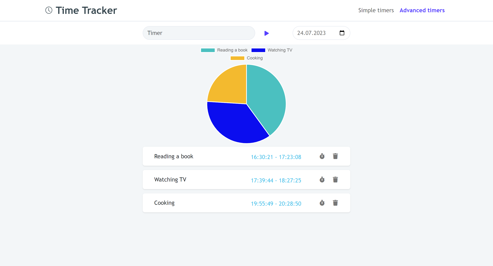

# TimeTracker

This application allows you to track the time you spend on various activities.

## API
The repository for the API can be found [here](https://github.com/BSkura98/time-tracker-api)

## Screenshots

## Technologies
* React
* JavaScript
* Redux
* Bootstrap
* SASS
* Chart.js

## Current features

- Start/stop timers
- Create new timers
- Edit timers
- Delete timers
- Save timers in local storage (it will be replaced by saving data in database)

To do list:
* Save and display more detailed data regarding timers - in progress
* Connect client app with API - in progress

## Status

Project is _in progress_

The first version of this project was created in April 2021 and its development was resumed in July 2023.
